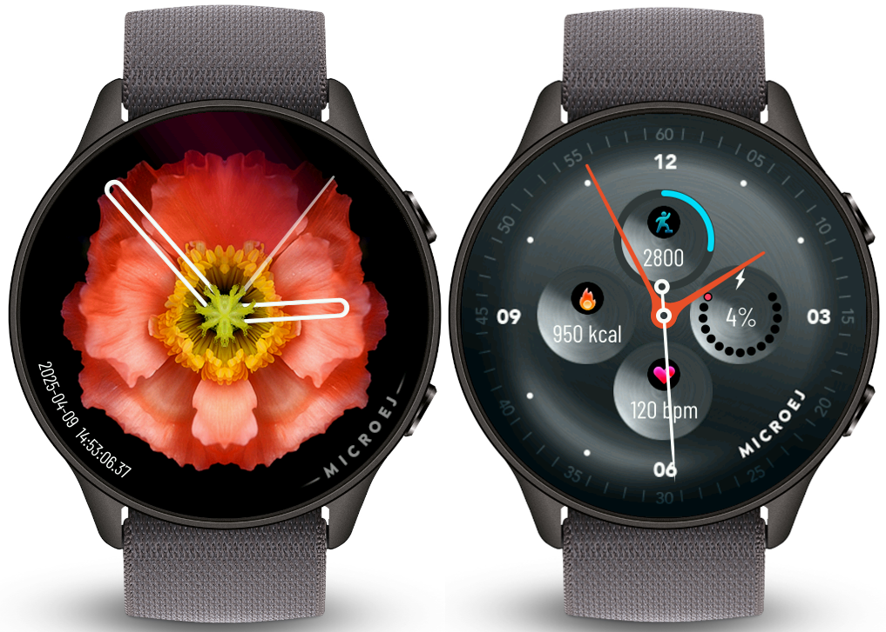
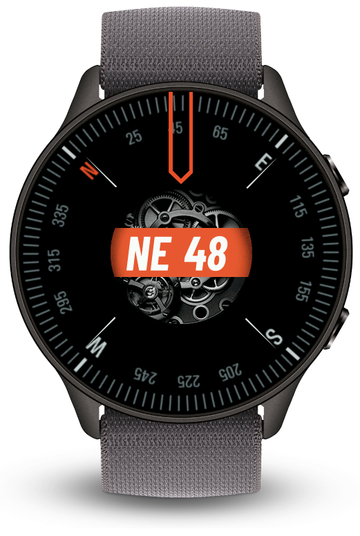
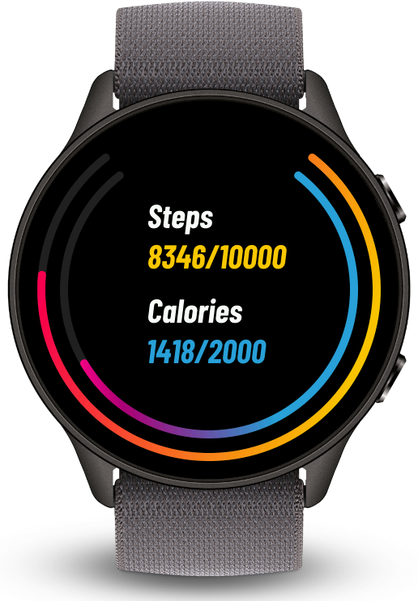
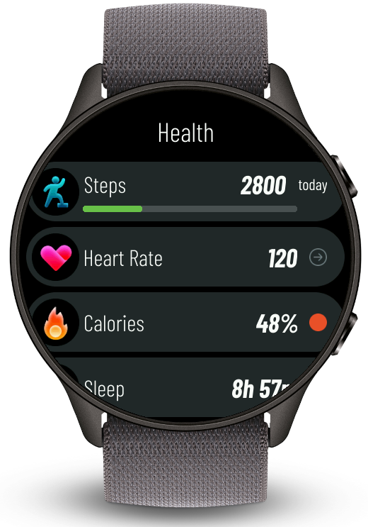
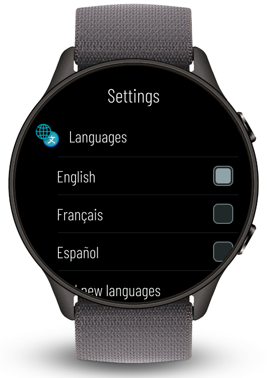
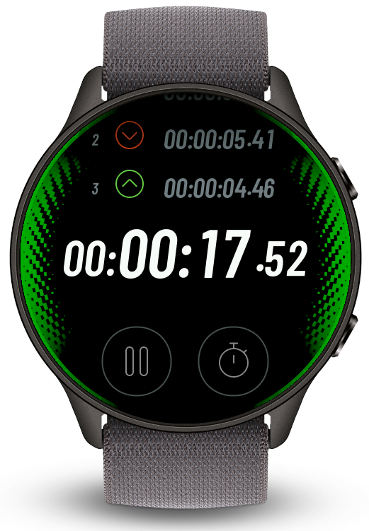
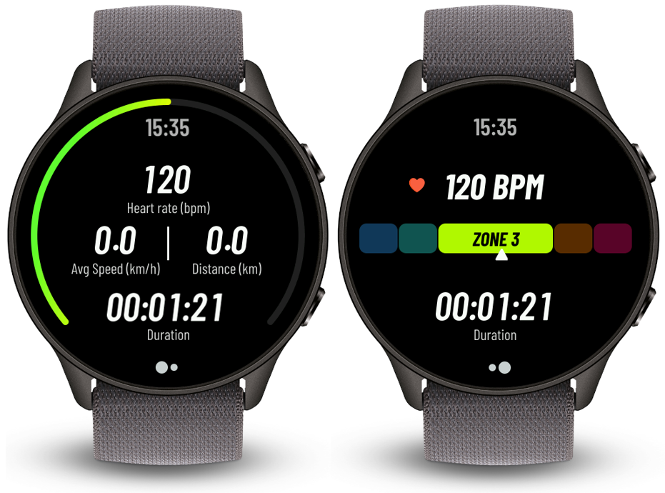
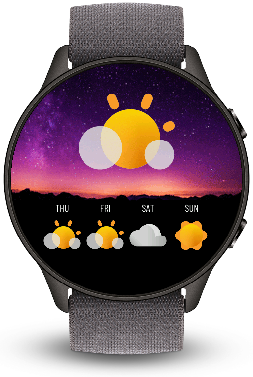

.. image:: https://shields.microej.com/endpoint?url=https://repository.microej.com/packages/badges/sdk_6.0.json
   :alt: sdk_6.0 badge
   :align: left
.. image:: https://shields.microej.com/endpoint?url=https://repository.microej.com/packages/badges/arch_8.0.json
   :alt: arch_8.0 badge
   :align: left
.. image:: https://shields.microej.com/endpoint?url=https://repository.microej.com/packages/badges/gui_3.json
   :alt: gui_3 badge
   :align: left

.. class:: center

Overview
========

This project provides samples of typical smartwatch applications.
These applications serve as code examples, demonstrating best practices and how to use the VEE Wear Kernel APIs.

Running on Simulator
--------------------

To run these applications on simulator, download the `VEE Wear Kernel Virtual Device <https://repository.microej.com/packages/wear/wear-kernel/1.3.0>`_.
Unzip the Kernel and reference it in the ``build.gradle.kts`` of the application you want to start::

	microejVee(files("path/to/wear-kernel-X.X.X/vee"))

Each sample provides a ``README.md`` that contains instructions on how to run it.

To run all the sample applications at once in the simulator, please refer to the ``README.md`` of the ``wear-runAll-app``.

.. warning::

   There is a `known issue <https://bugs.openjdk.org/browse/JDK-8296654>`__ with JavaFX and Apple Silicon computers. The task ``runOnSimulator`` fails with
   an error message: ``uncaught exception of type NSException``. Please refer to the `official documentation <https://docs.microej.com/en/latest/VEEPortingGuide/mock.html#javafx>`__ for more information.

To learn more about application development with the VEE Wear Framework, see https://docs.microej.com/en/latest/VEEWearUserGuide/framework.html.

**Note:** For more information, you can contact `MicroEJ Support <https://www.microej.com/contact/>`_ to get help or evaluate VEE Wear.

Details
=======

Watchfaces: Flower App & Sport App
----------------------------------

These two applications provide respectively a stylish and a sport-like watchface to customize the device.

Compass App
-----------

This application provides an example for a compass implementation.

Fitness App
-----------

This application offers an example to monitor steps and calorie intake.

Health App
----------

This application allows you to take a quick look at all the health-related data monitored by the watch.

Hello World
-----------

A simple application displaying 'Hello World' in an independent Activity.

Settings App
------------

This application provides an example for a Settings Activity.

Stopwatch App
-------------

This application provides a Stopwatch Activity.

Training App
------------

This application is an example for a Training Activity to monitor heart rate, distance and speed during a training.

Weather App
-----------

This application offers an implementation of a Weather Activity.

Troubleshooting
===============

Image Format
------------

ARGB8888, ARGB1555, and ARGB4444 transparent images may need to be pre-multiplied to be rendered properly by the GPU.

This can be achieved by adding the suffix ``_PRE`` to the image format in the ``*.images.list`` resource files.

For more details about image output format, see https://docs.microej.com/en/latest/ApplicationDeveloperGuide/UI/MicroUI/images.html#standard-output-formats.

--------------

.. ReStructuredText
.. Copyright 2024-2025 MicroEJ Corp. All rights reserved.
.. Use of this source code is governed by a BSD-style license that can be found with this software.